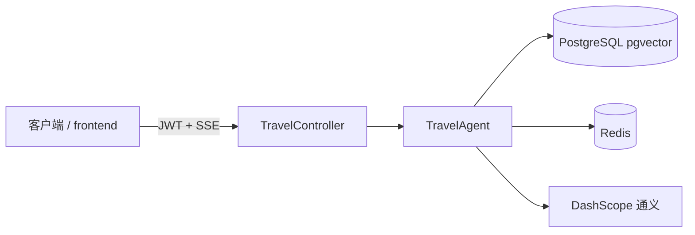

# Travel AI Planner

Spring Boot 后端：**RAG（pgvector）+ SSE 流式对话**；JWT 鉴权、按用户隔离的知识与 Redis 会话、限流与健康检查；可选最小前端。默认端口 **8081**。

[](https://github.com/vulgar26/travel-ai/actions/workflows/ci.yml)

---

## 文档

| 文档 | 内容 |
|------|------|
| [docs/IMPLEMENTATION_MATRIX.md](docs/IMPLEMENTATION_MATRIX.md) | **实现与计划对照**（本仓代码 ↔ 外部升级说明；含已做项与缺口） |
| [docs/ARCHITECTURE.md](docs/ARCHITECTURE.md) | 请求链路、安全、SSE、Compose |
| [docs/STATUS.md](docs/STATUS.md) | 当前能力摘要 |
| [CHANGELOG.md](CHANGELOG.md) | 版本变更记录 |

其余：`docs/UPGRADE_PLAN.md`（评审项清单）、`docs/eval.md`（手工 RAG 回归表）、`docs/demo.md`（演示步骤）、`frontend/README.md`（前端）、`docs/RESUME_BULLETS.md`（简历 bullet）。

---

## 架构一览



对话在 `TravelAgent` 内按固定顺序执行：**计划 → 检索 → 工具 → 门控 → 流式生成**；首包 SSE 为引用片段，随后为正文与心跳。细节见 [docs/ARCHITECTURE.md](docs/ARCHITECTURE.md)。

**PLAN 与评测对账**：草案经 `PlanParseCoordinator`（附录 E、`PlanParser`、至多一次 repair，与 `POST /api/v1/eval/chat` 同源）。成功解析后打 **`[plan]`** 行：`draft_source`（`llm` / `config_disabled` / `fallback_llm_error`）、`plan_parse_outcome`（`success` / `repaired`）、`plan_parse_attempts`（`1` 或 `2`）、`resolved`（`primary` / `fallback_template` / `builtin_minimal`），字段名与评测响应里的 `meta.plan_parse_*` 一致，便于把 SSE 日志与 eval run 对齐。

---

## 快速开始

### 前置

- JDK **21+**、Maven（或 IDE 内置；与 `pom.xml` 中 `maven.compiler` 一致）
- 本机 **PostgreSQL（含 pgvector）** 与 **Redis**，或使用 **Docker Compose** 一键起依赖

### 配置

敏感项不要提交仓库。任选其一：

- 环境变量（见下表），或
- `src/main/resources/application-local.yml`（已在 `.gitignore`；根 `application.yml` 已 `optional:import` 该文件）

### 本地运行（IDE）

1. 配置 `SPRING_AI_DASHSCOPE_API_KEY` 等（见环境变量表）。
2. 运行 `com.travel.ai.TravelAiApplication`。
3. 健康检查：`GET http://localhost:8081/actuator/health`

### Docker Compose

```powershell
Copy-Item .env.example .env   # 或 cp
# 编辑 .env：SPRING_AI_DASHSCOPE_API_KEY、APP_JWT_SECRET、POSTGRES_PASSWORD 等
docker compose up -d --build
```

应用 **8081**；映射 **5433→Postgres**、**6380→Redis**（见 `docker-compose.yml`）。表结构由 **Flyway** 迁移。

### 最小前端（可选）

```powershell
cd frontend
npm install
npm run dev
```

默认代理 `/api` → `8081`；演示账号 **demo / demo123**（与内存用户一致）。

---

## HTTP 接口

| 方法 | 路径 | 认证 | 说明 |
|------|------|------|------|
| `POST` | `/auth/login` | 否 | JSON 用户名密码，返回 JWT |
| `POST` | `/travel/conversations` | Bearer JWT | 服务端生成并登记 `conversationId`，JSON：`{"conversationId":"..."}` |
| `POST` | `/knowledge/upload` | Bearer JWT | `multipart/form-data`，字段 `file` |
| `GET` | `/travel/chat/{conversationId}?query=...` | Bearer JWT | **SSE**（`text/event-stream`）；`conversationId` 须符合字母数字与 `_-`，且长度 ≤128 |
| `POST` | `/api/v1/eval/chat` | **网关密钥** `X-Eval-Gateway-Key` + 已认证主体 | 评测用 **JSON**（非流式）；eval 侧另有 `X-Eval-Token` 等 membership 头，见 Vagent `eval-upgrade.md` |
| `GET` | `/actuator/health`、`/actuator/info` | 否 | 健康与信息 |

未带 JWT 访问受保护业务接口 → **401**。聊天超频 → **429**（JSON）。未配置或未携带正确评测网关密钥访问 `/api/v1/eval/**` → **401**。非法 `conversationId` 路径变量 → **400**。若 `app.conversation.require-registration=true` 且当前用户未登记该 ID → **403**。

---

## 环境变量

| 变量 | 说明 |
|------|------|
| `SPRING_AI_DASHSCOPE_API_KEY` | 通义千问（必需用于真实对话） |
| `APP_JWT_SECRET` | JWT 密钥；Compose/生产建议 ≥32 字符（`docker` 等 profile 下弱密钥会启动失败） |
| `WEATHER_API_KEY` | 天气 API（可选） |
| `APP_EVAL_GATEWAY_KEY` | 与请求头 `X-Eval-Gateway-Key` 一致；联调 eval 时必需 |

### `app.conversation`（`application.yml`）

| 配置项 | 含义 |
|--------|------|
| `app.conversation.require-registration` | `true` 时仅允许已通过 `POST /travel/conversations` 登记到当前用户的 `conversationId` 调用聊天 SSE；默认 `false` 兼容旧演示与测试 |

### `app.agent` 超时与步数（`application.yml`）

| 配置项 | 含义 |
|--------|------|
| `app.agent.total-timeout` | 单轮 SSE 总墙钟上限（订阅起至流结束） |
| `app.agent.max-steps` | 须 **≥ 5**（与固定阶段数一致）；过小则本轮直接返回提示，不跑模型 |
| `app.agent.tool-timeout` | 天气等工具 **HTTP** 超时（优先于 `weather.timeout-ms`） |
| `app.agent.llm-stream-timeout` | **WRITE** 阶段 LLM 流式超时 |
| `app.agent.plan-stage.enabled` | 是否在 PLAN 阶段调用无记忆 `ChatClient` 产结构化 JSON；关则走本地降级草案再经 `PlanParseCoordinator` 校验 |

### `app.eval`（评测 target，`application.yml`）

| 配置项 | 含义 |
|--------|------|
| `app.eval.gateway-key` / `APP_EVAL_GATEWAY_KEY` | 请求头 `X-Eval-Gateway-Key`；未配置则评测路径 401 |
| `app.eval.tool-timeout-ms` | TOOL stub 与 `app.agent.tool-timeout` 取 min 后的等待上限（毫秒） |
| `app.eval.stub-work-sleep-ms` | **仅测试**：阻塞 stub 主路径以验证整段 `total-timeout`；生产保持 **0** |

---

## 测试与 CI

- **全量**：`mvn test`（需 **Docker**：Testcontainers 起 Postgres + Redis）。
- **CI**：`.github/workflows/ci.yml` 在推送时跑 `mvn test`。

---

## 技术栈

Spring Boot 3、Spring AI Alibaba（DashScope）、PostgreSQL + pgvector、Redis、Spring Security + JWT、Bucket4j、Flyway、Docker Compose、Testcontainers。

版本号以 `pom.xml` 为准。
