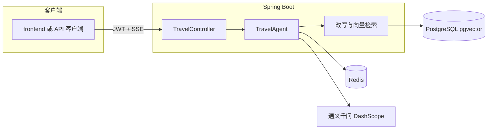

# 🗺️ Travel AI Planner · 智能出行规划助手

面向作品集与演示的 **RAG + SSE** 后端：**查询改写 → pgvector 检索 → 上下文增强 → 流式生成**；配套 JWT、限流、Docker Compose 与最小前端。

[](https://github.com/vulgar26/travel-ai/actions/workflows/ci.yml)

**当前里程碑**：[`v0.1-mvp`](CHANGELOG.md)（变更见 [`CHANGELOG.md`](CHANGELOG.md)）。

---

## 一页速览

| 项 | 说明 |
| --- | --- |
| 架构与可观测 | [`docs/ARCHITECTURE.md`](docs/ARCHITECTURE.md)（含 `[perf]` 分段耗时） |
| 约 60 秒演示 | [`docs/demo.md`](docs/demo.md) |
| 最小前端 | [`frontend/README.md`](frontend/README.md) |
| 简历表述 | [`docs/RESUME_BULLETS.md`](docs/RESUME_BULLETS.md) |
| 项目状态 | [`docs/STATUS.md`](docs/STATUS.md) |



---

## 项目亮点

- **一条 RAG 链路收口**：`QueryRewriter` 生成多路检索 query → `VectorStore`（pgvector）召回 → 拼进 prompt → **SSE** 流式输出；同一请求内不重复检索，成本与延迟可控。
- **按用户隔离的知识与记忆**：上传与检索写入 `metadata.user_id`，SQL 侧过滤；Redis 对话 key 与 **Spring Security** 当前用户绑定，避免多账号串库。
- **可解释 + 可观测**：SSE **首段 `data`** 输出本轮引用片段（id / 来源 / 正文摘要）；日志中带 MDC `requestId` 与 **`[perf]`** 分段耗时（改写、检索、首 token、流结束），便于对照慢在哪一段。
- **最小「能上线」包**：JWT 保护业务接口；`/travel/chat` **Bucket4j** 限流（超额 429 + JSON）；LLM 与天气工具 **超时与降级**；**Actuator** 健康探活，方便 Compose / 负载均衡验收。
- **SSE 工程细节**：`ServerSentEvent` 区分正文与 **comment 心跳**；`share()` 合并心跳与正文，避免重复打模型；断线时取消订阅可追踪。
- **向量与 schema 工程化**：自研 **JDBC + pgvector** 实现 Spring AI `VectorStore`；**Flyway** 管理表结构；**Docker Compose** 拉齐 App / Postgres / Redis。
- **可复现与产品感**：**Testcontainers** 集成测试 + **GitHub Actions** `mvn test`；仓库内 **`frontend/`** 最小登录 + 流式演示页；评测问题集见 **`docs/eval.md`**。
- **工具扩展**：集成 **天气** `WeatherTool`（API Key 可选），由模型按需调用。

---

## 技术栈

| 类别 | 选型 |
| --- | --- |
| 框架 | Spring Boot 3.3.5、Spring AI Alibaba 1.1.2.0 |
| 模型 | 通义千问 `qwen3.5-plus`（DashScope） |
| 数据 | PostgreSQL + **pgvector**、Redis |
| 交付 | Docker Compose、Flyway、Testcontainers、GitHub Actions |

---

## 核心 API（需登录部分）

| 能力 | 方法 | 路径 | 说明 |
| --- | --- | --- | --- |
| 登录 | `POST` | `/auth/login` | 演示账号见下文；返回 JWT |
| 上传知识 | `POST` | `/knowledge/upload` | `multipart/form-data`，字段 `file` |
| 对话（SSE） | `GET` | `/travel/chat/{conversationId}?query=...` | Header：`Authorization: Bearer <JWT>` |
| 健康检查 | `GET` | `/actuator/health` | 匿名可访问聚合状态 |

未带有效 JWT 访问受保护接口返回 **401**；聊天接口触发限流返回 **429**（JSON 错误体）。

---

## 环境变量

敏感配置不要写进仓库；可用环境变量或 **`src/main/resources/application-local.yml`**（已在 `.gitignore`，勿提交）。

| 变量名 | 说明 | 必需 |
| --- | --- | --- |
| `SPRING_AI_DASHSCOPE_API_KEY` | 通义千问 API Key | 是 |
| `APP_JWT_SECRET` | JWT 签名密钥（建议 ≥32 字节随机串） | 生产与 Compose 为是 |
| `WEATHER_API_KEY` | 天气 API | 视是否启用天气功能 |

---

## 本地运行

### 方式一：IDE

1. 准备本机 **PostgreSQL（含 pgvector）** 与 **Redis**，或在 `application-local.yml` 中指向可用实例。
2. 设置 `SPRING_AI_DASHSCOPE_API_KEY`（及可选变量），或写入 `application-local.yml`。
3. 运行主类 `TravelAiApplication`（默认端口 **8081**）。

### 方式二：Docker Compose（推荐）

依赖：Docker Desktop 或 Docker Engine + Compose v2。

1. `Copy-Item .env.example .env`（Windows）或 `cp .env.example .env`
2. 编辑 `.env`：至少填写 **`SPRING_AI_DASHSCOPE_API_KEY`**，并确认 **`APP_JWT_SECRET`**、**`POSTGRES_PASSWORD`**
3. 项目根目录：`docker compose up -d --build`
4. 验收：`curl http://localhost:8081/actuator/health` → `{"status":"UP"}`

说明：

- 表结构由 **Flyway** 启动时执行（如 `db/migration/V1__init_pgvector.sql`）。
- 宿主机端口映射：**`8081`**（应用）、**`5433→5432`**（Postgres）、**`6380→6379`**（Redis）；容器内仍用服务名 `postgres`、`redis`。
- 镜像拉取若在国内较慢，可参考 `.env.example` 中的镜像源说明或配置 Docker **registry-mirrors**。

### 最小前端（可选）

后端在 **8081** 就绪后：

```powershell
cd frontend
npm install
npm run dev
```

浏览器打开提示地址（多为 `http://localhost:5173`），演示账号 **`demo` / `demo123`**。Vite 将 `/api` 代理到 `http://127.0.0.1:8081`。

---

## 测试与 CI

- **集成测试**：本机需 **Docker**。根目录执行 `mvn test`（Testcontainers 拉起临时 Postgres + Redis，跑 Flyway、`/actuator/health` 等）。
- 无 Docker 时可跑部分单测：`mvn test -Dtest=KnowledgeServiceImplTest`
- **CI**：推送至 `main` 时 GitHub Actions 执行 `mvn test`（见 `.github/workflows/ci.yml`）。

---

## 发布标签

已发布 **`v0.1-mvp`**。若需在新提交上重建标签：

```bash
git tag -a v0.1-mvp -m "MVP: RAG + SSE + JWT + Compose + 前端"
git push origin v0.1-mvp
```

（若远程已存在同名标签，需先 `git tag -d v0.1-mvp` 与远端协调后再打。）
