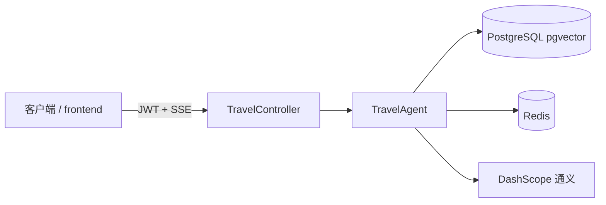

# Travel AI Planner

Spring Boot 后端：**RAG（pgvector）+ SSE 流式对话**；JWT 鉴权、按用户隔离的知识与 Redis 会话、限流与健康检查；可选最小前端。默认端口 **8081**。

[](https://github.com/vulgar26/travel-ai/actions/workflows/ci.yml)

---

## 文档

| 文档 | 内容 |
|------|------|
| [docs/IMPLEMENTATION_MATRIX.md](docs/IMPLEMENTATION_MATRIX.md) | **实现与计划对照**（本仓代码 ↔ 外部升级说明；含已做项与缺口） |
| [docs/ARCHITECTURE.md](docs/ARCHITECTURE.md) | 请求链路、安全、SSE、Compose |
| [docs/STATUS.md](docs/STATUS.md) | 当前能力摘要 |
| [CHANGELOG.md](CHANGELOG.md) | 版本变更记录 |
| [docs/eval/P0_THRESHOLD_RUNBOOK.md](docs/eval/P0_THRESHOLD_RUNBOOK.md) | **P0 数值门槛**：如何用 eval **`run.report`** 逐项核对 SSOT 比例（公式、`meta`/`latency_ms`、与离线 `EvalChatControllerTest` 烟测边界） |
| [docs/eval/SOURCES_EVAL_VS_SSE.md](docs/eval/SOURCES_EVAL_VS_SSE.md) | **`sources[]`（评测 JSON）与 SSE 引用块**：同源 `Document`、载体与截断差异、对账建议 |
| [docs/eval/P1_HARNESS_GAP.md](docs/eval/P1_HARNESS_GAP.md) | **P1-0 harness**：评测 `meta` 已具备字段 vs 缺口清单与分步实现建议（已补 `context_truncated` / `config_snapshot_hash` / `context_token_estimate` 近似） |
| [docs/eval/LLM_REAL_USAGE_RUNBOOK.md](docs/eval/LLM_REAL_USAGE_RUNBOOK.md) | **`llm_mode=real`**：何时开 **`app.eval.llm-real-enabled`**、**`eval_tags`** 抽样、`provider_usage_*` 归因与成本/合规注意 |
| [docs/eval/CI_AND_REMOTE_EVAL.md](docs/eval/CI_AND_REMOTE_EVAL.md) | **CI vs 远程全量 eval**：默认 `mvn test` 已覆盖什么、为何不默认打公网 target、staging 全量建议 |

其余：`docs/UPGRADE_PLAN.md`（评审项清单）、`docs/eval.md`（手工 RAG 表 + **评测口对抗/安全/RAG 确定性用例与建议 tags**）、`docs/demo.md`（演示步骤）、`frontend/README.md`（前端）、`docs/RESUME_BULLETS.md`（简历 bullet）。

---

## 架构一览



对话在 `TravelAgent` 内按固定顺序执行：**计划 → 检索 → 工具 → 门控 → 流式生成**；SSE 在引用片段与正文之前先发 **`event: plan_parse`**（JSON 内含 `plan_parse_outcome`、`plan_parse_attempts`、`plan_draft_source`、`plan_parse_resolved`、`request_id`），随后为引用片段、`data` 正文与 `comment` 心跳。细节见 [docs/ARCHITECTURE.md](docs/ARCHITECTURE.md)。

**PLAN 与评测对账**：草案经 `PlanParseCoordinator`（附录 E、`PlanParser`、至多一次 repair，与 `POST /api/v1/eval/chat` 同源）。成功解析后打 **`[plan]`** 日志，且与 SSE **`plan_parse`** 事件同字段口径：`plan_draft_source`（`llm` / `config_disabled` / `fallback_llm_error`）、`plan_parse_outcome`（`success` / `repaired`）、`plan_parse_attempts`（`1` 或 `2`）、`plan_parse_resolved`（`primary` / `fallback_template` / `builtin_minimal`），与评测 `meta.plan_parse_*` 一致，便于把 SSE 与 eval run 对齐。

---

## 快速开始

### 前置

- JDK **21+**、Maven（或 IDE 内置；与 `pom.xml` 中 `maven.compiler` 一致）
- 本机 **PostgreSQL（含 pgvector）** 与 **Redis**，或使用 **Docker Compose** 一键起依赖

### 配置

敏感项不要提交仓库。任选其一：

- 环境变量（见下表），或
- `src/main/resources/application-local.yml`（已在 `.gitignore`；根 `application.yml` 已 `optional:import` 该文件）

### 本地运行（IDE）

1. 配置 `SPRING_AI_DASHSCOPE_API_KEY` 等（见环境变量表）。
2. 运行 `com.travel.ai.TravelAiApplication`。
3. 健康检查：`GET http://localhost:8081/actuator/health`

### Docker Compose

```powershell
Copy-Item .env.example .env   # 或 cp
# 编辑 .env：SPRING_AI_DASHSCOPE_API_KEY、APP_JWT_SECRET、POSTGRES_PASSWORD 等
docker compose up -d --build
```

应用 **8081**；映射 **5433→Postgres**、**6380→Redis**（见 `docker-compose.yml`）。表结构由 **Flyway** 迁移。

### 最小前端（可选）

```powershell
cd frontend
npm install
npm run dev
```

默认代理 `/api` → `8081`；演示账号 **demo / demo123**（与内存用户一致）。

---

## HTTP 接口

| 方法 | 路径 | 认证 | 说明 |
|------|------|------|------|
| `POST` | `/auth/login` | 否 | JSON 用户名密码，返回 JWT |
| `POST` | `/travel/conversations` | Bearer JWT | 服务端生成并登记 `conversationId`，JSON：`{"conversationId":"..."}` |
| `POST` | `/knowledge/upload` | Bearer JWT | `multipart/form-data`，字段 `file`；**JSON** 响应：`200` 时 `ok`、`fileName`、`chunkCount`、`message`；`4xx/5xx` 时 `error` + `message` |
| `GET` | `/travel/profile` | Bearer JWT | 长期画像 JSON：`schemaVersion` + `profile`（对象；无记录时为空对象） |
| `PUT` | `/travel/profile` | Bearer JWT | 请求体 `{"profile":{...}}` 整包替换（顶层仅字符串/数字/布尔；槽位与长度见 `app.memory.profile.*`） |
| `PATCH` | `/travel/profile` | Bearer JWT | 请求体 `{"profile":{...}}` 浅合并；字段置 `null` 表示删除该键 |
| `DELETE` | `/travel/profile` | Bearer JWT | 删除当前用户画像（**204**；幂等）。可选查询参数 `clearChatMemory=true`：同时删 Redis 短期会话；可再加 `conversationId=…` 只清该会话 |
| `POST` | `/travel/profile/extract-suggestion` | Bearer JWT | 从 Redis 会话抽取画像建议 JSON；体 `{"conversationId":"…","saveAsPending":true}`；须 `app.memory.auto-extract.enabled=true` |
| `GET` | `/travel/profile/pending-extraction?conversationId=…` | Bearer JWT | 读取待确认的合并预览（无则 **404**） |
| `POST` | `/travel/profile/confirm-extraction` | Bearer JWT | 体 `{"conversationId":"…"}` 将待确认合并结果写入 PG 并清除 pending |
| `DELETE` | `/travel/profile/pending-extraction?conversationId=…` | Bearer JWT | 放弃待确认（**204**） |
| `POST` | `/travel/chat/{conversationId}` | Bearer JWT | **SSE**（`Accept: text/event-stream`）；`Content-Type: application/json`，体 `{"query":"..."}`（**推荐**；无 URL 长度限制、减少 query 出现在访问日志路径中的风险）；`conversationId` 规则同下；超长 `query` → **400**（见 `app.conversation.max-query-chars`） |
| `GET` | `/travel/chat/{conversationId}?query=...` | Bearer JWT | **SSE**（同上）；**兼容保留**，响应带 `Deprecation: true`；新集成请改用 **POST** |
| `POST` | `/api/v1/eval/chat` | **网关密钥** `X-Eval-Gateway-Key` + 已认证主体 | 评测用 **JSON**（非流式）；eval 侧另有 `X-Eval-Token` 等 membership 头，见 Vagent `eval-upgrade.md` |
| `GET` | `/actuator/health`、`/actuator/info` | 否 | 健康与信息 |

未带 JWT 访问受保护业务接口 → **401**。聊天或登录超频 → **429**（JSON：`error` + `message`，例如 `error=RATE_LIMITED`）。未配置或未携带正确评测网关密钥访问 `/api/v1/eval/**` → **401**。非法 `conversationId` 路径变量 → **400**。若 `app.conversation.require-registration=true` 且当前用户未登记该 ID → **403**。聊天 `query` 超出 `app.conversation.max-query-chars`（GET 与 POST 共用）→ **400**（JSON，`error`+`message`）。

---

## 环境变量

| 变量 | 说明 |
|------|------|
| `SPRING_AI_DASHSCOPE_API_KEY` | 通义千问（必需用于真实对话） |
| `APP_JWT_SECRET` | JWT 密钥；Compose/生产建议 ≥32 字符（`docker` 等 profile 下弱密钥会启动失败） |
| `WEATHER_API_KEY` | 天气 API（可选） |
| `APP_EVAL_GATEWAY_KEY` | 与请求头 `X-Eval-Gateway-Key` 一致；联调 eval 时必需 |

### `app.memory`（长期画像，`application.yml`）

| 配置项 | 含义 |
|--------|------|
| `app.memory.long-term.enabled` | `true` 时主线可从库读取画像；默认 `false` |
| `app.memory.long-term.inject-into-prompt` | 在 `enabled=true` 时是否把画像块注入 `TravelAgent` WRITE 前最终 prompt |
| `app.memory.long-term.skip-usernames` | 不加载/不注入的主体名（如 `anonymous`、`eval-gateway`） |
| `app.memory.profile.max-slots` | 顶层字段数量上限（默认 10） |
| `app.memory.profile.max-value-chars` | 单个字符串值最大长度 |
| `app.memory.profile.max-inject-chars` | 注入 prompt 的 JSON 文本最大字符数（超出截断） |
| `app.memory.auto-extract.enabled` | 为 `true` 时才允许 LLM 抽取（手动 `extract-suggestion` 与 `after-chat`） |
| `app.memory.auto-extract.after-chat` | 每轮 SSE 正常结束后异步抽取（仍受 `enabled` 约束） |
| `app.memory.auto-extract.require-confirm` | `true`（默认）：仅写 Redis 待确认；`false`：after-chat 路径下**直接** upsert 画像（慎用） |
| `app.memory.auto-extract.pending-ttl` | 待确认 Redis 记录 TTL |
| `app.memory.auto-extract.llm-timeout-seconds` | 抽取调用墙钟上限 |

### `app.conversation`（`application.yml`）

| 配置项 | 含义 |
|--------|------|
| `app.conversation.require-registration` | `true` 时仅允许已通过 `POST /travel/conversations` 登记到当前用户的 `conversationId` 调用聊天 SSE；默认 `false` 兼容旧演示与测试 |
| `app.conversation.max-query-chars` | 单轮用户 `query` 最大字符数（**POST** JSON 与 **GET** 查询参数共用）；默认 **8192**；超出返回 **400** |

### `app.agent` 超时与步数（`application.yml`）

| 配置项 | 含义 |
|--------|------|
| `app.agent.total-timeout` | 单轮 SSE 总墙钟上限（订阅起至流结束） |
| `app.agent.max-steps` | 须 **≥ 5**（与固定阶段数一致）；过小则本轮直接返回提示，不跑模型 |
| `app.agent.tool-timeout` | 天气等工具 **HTTP** 超时（优先于 `weather.timeout-ms`） |
| `app.agent.llm-stream-timeout` | **WRITE** 阶段 LLM 流式超时 |
| `app.agent.plan-stage.enabled` | 是否在 PLAN 阶段调用无记忆 `ChatClient` 产结构化 JSON；关则走本地降级草案再经 `PlanParseCoordinator` 校验 |

### `app.eval`（评测 target，`application.yml`）

| 配置项 | 含义 |
|--------|------|
| `app.eval.gateway-key` / `APP_EVAL_GATEWAY_KEY` | 请求头 `X-Eval-Gateway-Key`；未配置则评测路径 401 |
| `app.eval.tool-timeout-ms` | TOOL stub 与 `app.agent.tool-timeout` 取 min 后的等待上限（毫秒） |
| `app.eval.stub-work-sleep-ms` | **仅测试**：阻塞 stub 主路径以验证整段 `total-timeout`；生产保持 **0** |
| `app.eval.reflection-meta-enabled` | 是否在 `meta` 中写入 `recovery_action` / 场景下的 `self_check`（评测 stub）；`false` 时完全不写字段 |
| `app.eval.llm-real-enabled` | 是否允许评测口在请求体 `{"llm_mode":"real"}` 时触发一次真实 LLM 调用以获取 provider usage（默认 **false**，避免 CI/本地误触发外网与成本） |
| `app.eval.llm-real-timeout-ms` | 评测口 real LLM “usage 探针” 的额外超时上限（毫秒）；避免为了拿 usage 拖慢整段评测（默认 1200） |
| `app.eval.llm-real-require-tag-match` | 为 **true**（默认）时：仅当请求体 `eval_tags` 中至少一条以 `app.eval.llm-real-required-tag-prefixes` 某一前缀开头时才触发探针；避免跑批全量计费 |
| `app.eval.llm-real-required-tag-prefixes` | 与上一项联用的前缀列表（YAML 数组）；省略时默认仅 `cost/`（评测平台可对抽样行打 `cost/...` 类 tag） |

开启 **`llm-real-enabled`** 做 provider usage 对账前，请先读 **[`docs/eval/LLM_REAL_USAGE_RUNBOOK.md`](docs/eval/LLM_REAL_USAGE_RUNBOOK.md)**（抽样、`eval_tags`、归因码与合规）。

评测请求体可选 **`eval_reflection_scenario`**：`self_check_ok` → `meta.recovery_action=continue` 且带 `meta.self_check`；`recovery_suggest_clarify` → `meta.recovery_action=suggest_clarify`。默认成功路径为 `recovery_action=none`（与 `replan_count=0` 正交，无二次 plan LLM）。

---

## 测试与 CI

- **全量**：`mvn test`（需 **Docker**：Testcontainers 起 Postgres + Redis）。
- **CI**：`.github/workflows/ci.yml` 在推送时跑 `mvn test`。

---

## 技术栈

Spring Boot 3、Spring AI Alibaba（DashScope）、PostgreSQL + pgvector、Redis、Spring Security + JWT、Bucket4j、Flyway、Docker Compose、Testcontainers。

版本号以 `pom.xml` 为准。
