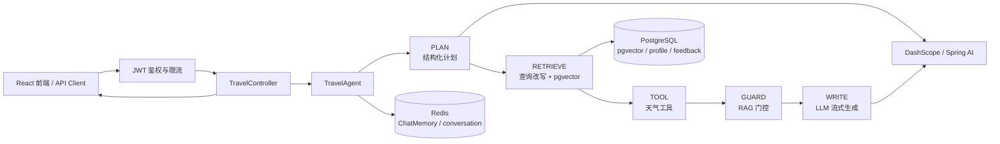

# Travel AI Planner 项目总览

Travel AI Planner 是一个面向旅行规划场景的 Spring Boot 3 + Spring AI Alibaba 应用。项目重点不是只调用大模型生成行程，而是围绕真实后端链路实现了登录鉴权、知识上传、向量检索、Redis 会话记忆、Agent 阶段编排、SSE 流式输出、用户画像、反馈和 eval 接口。

一句话概括：这是一个可解释的 RAG + SSE 流式旅行规划系统，并配套了演示前端和评测 harness。

## 当前状态

已完成：

- 登录与鉴权：基于 Spring Security + JWT，业务接口默认需要 Bearer Token。
- 会话管理：支持服务端签发 `conversationId`，可配置强制校验会话归属。
- 知识上传：支持 `.txt` 文件上传，后端分块、向量化并写入 pgvector。
- 多用户知识隔离：向量 metadata 写入 `user_id`，检索时按当前用户过滤。
- RAG 对话：支持查询改写、向量检索、上下文拼接和引用片段输出。
- Agent 编排：主线按 `PLAN -> RETRIEVE -> TOOL -> GUARD -> WRITE` 固定阶段执行。
- 结构化计划解析：PLAN 阶段产物经过 parser / repair / fallback，保证可解析。
- 工具调用：集成天气工具，并配有超时、限流、熔断和观测信息。
- 门控策略：知识库无命中时能返回清晰说明，避免直接编造答案。
- SSE 流式输出：支持正文 token 流、`plan_parse`、阶段事件、策略事件、心跳、完成和错误事件。
- Redis 短期记忆：基于 Redis 保存对话上下文。
- Postgres 长期画像：保存用户画像，支持从对话抽取画像建议并确认写入。
- 用户反馈：支持点赞/点踩、评分、评论、eval 归因字段和分页查询。
- Eval 接口：提供 `/api/v1/eval/chat` 非流式评测接口，输出结构化 `meta`。
- 工程化部署：提供 Dockerfile、Docker Compose、Flyway 迁移、Actuator 健康检查。
- 自动化测试：使用 JUnit、Spring Boot Test、Testcontainers，并通过 GitHub Actions 执行 CI。
- 前端最小展示界面：已完成。当前 React 前端可展示登录、上传知识、SSE 聊天、Agent 阶段、引用来源、用户画像区域和反馈提交。

未声明完成：

- P1+ 产品化能力未标为已完成。
- 完整账号体系、知识库管理闭环、rerank、PDF/网页/Markdown 多格式解析、eval dashboard、生产级观测和部署治理仍属于后续方向。

## 核心链路



主线请求顺序：

1. 前端登录获取 JWT。
2. 创建或指定 `conversationId`。
3. 上传知识文件，后端写入 pgvector。
4. 调用 `POST /travel/chat/{conversationId}` 发起 SSE。
5. `TravelAgent` 执行 PLAN、RETRIEVE、TOOL、GUARD、WRITE。
6. 后端通过 SSE 返回计划解析、引用、阶段事件、策略事件、正文 token 和完成事件。

## 前端展示能力

前端位于 `frontend`，当前定位是“前端最小展示界面”，用于验证和演示后端已具备能力。

已覆盖：

- 登录状态展示和 `POST /auth/login`。
- 自动创建会话并使用 `POST /travel/conversations` 返回的 `conversationId`。
- `.txt` 知识上传和上传结果展示。
- `POST /travel/chat/{conversationId}` SSE 流式聊天。
- 用户/助手消息气泡、loading / streaming 状态、停止输出和常见 HTTP 错误提示。
- `plan_parse`、`stage`、`policy`、`done`、`error` SSE 事件展示。
- 引用来源展示，兼容结构化 sources / citation 事件和文本引用片段。
- 用户画像区域，支持当前画像、抽取建议、pending extraction、确认、忽略、重置。
- 反馈提交和最近反馈列表。

详细验收见 [FRONTEND_DEMO.md](FRONTEND_DEMO.md)。

## 技术架构

后端技术栈：

- Java 21
- Spring Boot 3
- Spring Web / Spring Security / Spring JDBC / Actuator
- Spring AI Alibaba + DashScope
- PostgreSQL + pgvector
- Redis
- Flyway
- Bucket4j + Caffeine
- JJWT
- Reactor `Flux<ServerSentEvent<String>>`

前端技术栈：

- Vite
- React 18
- Fetch API
- 手写 text/event-stream 解析逻辑

数据表：

- `vector_store`：保存文档 chunk、metadata 和 embedding。
- `user_profile`：保存长期用户画像 JSON。
- `eval_conversation_checkpoint`：保存 eval 回放 checkpoint。
- `user_feedback`：保存用户反馈、评分和 eval 归因字段。

关键入口：

- 对话入口：`src/main/java/com/travel/ai/controller/TravelController.java`
- Agent 主线：`src/main/java/com/travel/ai/agent/TravelAgent.java`
- 向量库实现：`src/main/java/com/travel/ai/config/PgVectorStore.java`
- 知识上传：`src/main/java/com/travel/ai/service/impl/KnowledgeServiceImpl.java`
- 安全配置：`src/main/java/com/travel/ai/security/SecurityConfig.java`
- Eval 服务：`src/main/java/com/travel/ai/eval/EvalChatService.java`
- 前端入口：`frontend/src/App.jsx`

## Eval 评测能力

项目内置独立评测接口 `POST /api/v1/eval/chat`。该接口与主线 SSE 不同，返回 JSON，适合自动化评测、离线回归和外部 harness 对接。

已实现的 eval 能力包括：

- 通过 `X-Eval-Gateway-Key` 保护 eval 路径。
- eval stub 与主线保持 `PLAN -> RETRIEVE -> TOOL -> GUARD -> WRITE` 阶段语义。
- 输出 `stage_order`、`step_count`、`replan_count`、timeout 配置、request id 等结构化 `meta`。
- 记录 `plan_parse_outcome`、`plan_parse_attempts`、`plan_draft_source` 等计划解析元数据。
- 支持 retrieval hits、source、低置信门控和相关归因字段。
- 在安全、RAG、工具、行为策略短路点写入结构化 policy events。
- 生成配置快照 hash，便于评测报告和环境对账。
- 可按配置和 tag 触发真实 LLM usage 探针，默认避免 CI 或本地误触发外部成本。
- 支持以 conversation id 持久化 eval checkpoint。

## 已知不足

- 前端已完成最小展示界面，但仍不是完整产品级体验。
- 用户体系目前使用 demo 用户，未落库成完整生产账号体系。
- 知识库管理缺少文件列表、删除、更新、重复上传治理和重建索引 UI。
- 当前主要支持 `.txt` 文档，PDF、网页、Markdown 多格式解析仍未完成。
- RAG 质量增强如 rerank、score threshold、引用强校验仍可继续推进。
- Eval 能力较强，但缺少可视化 dashboard 或稳定报告页。
- 生产级观测、密钥治理、反向代理和部署安全说明仍需补齐。

## 后续路线

后续可继续推进：

1. 知识库管理闭环：文件列表、删除、重建索引、来源筛选和上传状态。
2. 账号体系落库：注册登录、密码哈希、角色权限和 token 生命周期治理。
3. RAG 质量提升：rerank、score threshold、引用覆盖率检查和答案来源约束。
4. 多格式文档解析：Markdown、PDF、网页抓取和结构化 metadata。
5. 用户画像产品化：更完整的查看、编辑、确认、审计和删除体验。
6. Eval 报告化：展示命中率、延迟、策略事件、失败归因和配置快照。
7. 可观测升级：接入 Micrometer / Prometheus，将当前日志指标转为可查询指标。
8. 部署增强：补充生产 profile、密钥管理、反向代理和容器健康探针说明。

## 本地运行

推荐方式见 [LOCAL_DEV.md](LOCAL_DEV.md)：

```powershell
docker compose up -d postgres redis
```

然后在 IDEA 中运行 `com.travel.ai.TravelAiApplication`。IDEA 本地运行时：

- Postgres 使用 `localhost:5433`
- Redis 使用 `localhost:16379`

前端运行：

```powershell
cd frontend
npm install
npm run dev
```

默认演示账号：

- username: `demo`
- password: `demo123`
